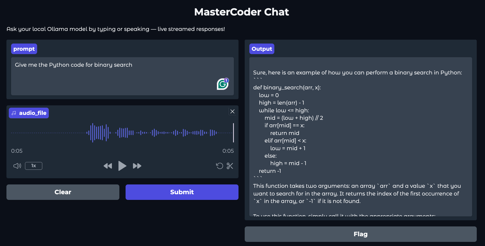

# 🌍 MultiLanguage Code Assistant using CodeLlama

An intelligent **multi-language code assistant** built with **Gradio** and powered by **CodeLlama via Ollama** — capable of understanding, generating, and explaining code across multiple programming languages through **text and voice**.  
This project combines **real-time streaming responses**, **speech-to-text input**, and a **modern gradient UI** to deliver an interactive AI coding experience locally.

---

## 🖼️ Demo

### Below is a snapshot of the running application 👇  


---


## 🚀 Features

✅ **Supports Multiple Programming Languages**
> Generate, debug, or explain code in Python, Java, C++, JavaScript, and more.

🎤 **Voice Input Support**
> Speak your coding questions directly — powered by `speech_recognition`.

⚡ **Live Streaming Output**
> See responses appear in real-time with auto-scrolling output box.

🎨 **Modern UI**
> Built using Gradio’s latest features with a soft gradient background and theme.

🧠 **Local Inference with Ollama**
> Runs fully offline with CodeLlama or any local GGUF model of your choice.

---

## 🧩 Tech Stack

| Component | Description |
|------------|-------------|
| **Ollama** | Local model server for LLMs (e.g., CodeLlama, Llama2) |
| **CodeLlama Model** | Code generation and explanation model used via Ollama |
| **Python** | Core scripting and logic implementation |
| **Gradio** | Interactive web UI |
| **SpeechRecognition** | Converts microphone input to text |
| **Requests + JSON** | Handles API communication with Ollama |

---

## 🧠 How It Works

1. The user provides a prompt — either **typed** or **spoken**.
2. The input is sent to the **Ollama local API** (`http://localhost:11434/api/generate`).
3. **CodeLlama** processes the query and returns a streaming response.
4. Gradio’s interface displays the generated output in real time.

---


## 🛠️ Installation

### 1️⃣ Clone the repository
```bash
git clone https://github.com/pahul1712/MultiLanguage-Code-Assistant-Using-CodeLlama.git
cd MultiLanguage-Code-Assistant-Using-CodeLlama
```

### 2️⃣ Create a virtual environment
```bash
python3 -m venv venv
source venv/bin/activate   # For macOS/Linux
venv\Scripts\activate      # For Windows
```

### 3️⃣ Install dependencies
```bash
pip install -r requirements.txt
```

### 4️⃣ Run Ollama and pull the model
```bash
ollama serve
ollama pull codellama
```

### 5️⃣ Launch the app
```bash
python app.py
```

---

## 📁 Repository Structure
``` bash
📦 MultiLanguage-Code-Assistant-Using-CodeLlama
 ┣ 📂 images/              # Demo screenshots
 ┣ 📂 venv/                # Virtual environment (ignored this) 
 ┣ 📜 app.py               # Main Gradio app
 ┣ 📜 modelFile            # Ollama model import file
 ┣ 📜 requirements.txt     # Python dependencies
 ┣ 📜 README.md            # Documentation
 ┣ 📜 .gitignore
```

---

## 🔧 Example Prompts

- “Write a Python function for binary search.”
- “Explain recursion with an example in Java.”
- “Generate SQL query to find employees earning above the average salary.”
- “Translate this code from C++ to Python.”
- “Write a REST API in Flask for a to-do list.”

---

🧑‍💻 Author

Pahuldeep Singh Dhingra  
📍 Florida Atlantic University  
💼 Graduate Teaching Assistant | MS in Data Science & Analytics  
🌐 [LinkedIn](https://www.linkedin.com/in/pahuldeepsing/)  | 📑 [GitHub](https://github.com/pahul1712)  


